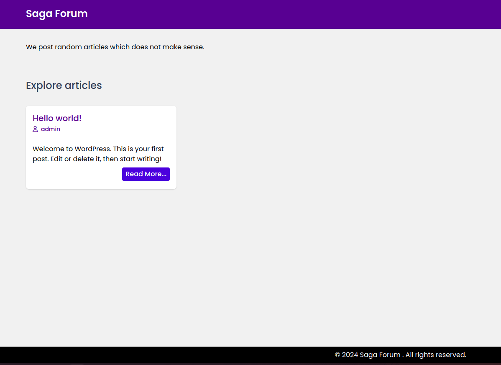

# BlogPro

A basic blog theme for lazy SEO hackers.



## Development guide

Yourself figure out for Windows :/

Guide for Linux only.

### Running local php server

Make sure to install php-mysqli.

```shell
php -S localhost:8000
```

### Watching tailwind utilities

```shell
npm install
chmod +x watch.sh

# Make sure to run this script always in background during development.
./watch.sh
```

### Building theme

Generate `blog-pro.zip` with the following command.

```shell
chmod +x build.sh
./build.sh
```

## Conclusion

This template is made by lazy indie developer to play with low KD searches.
